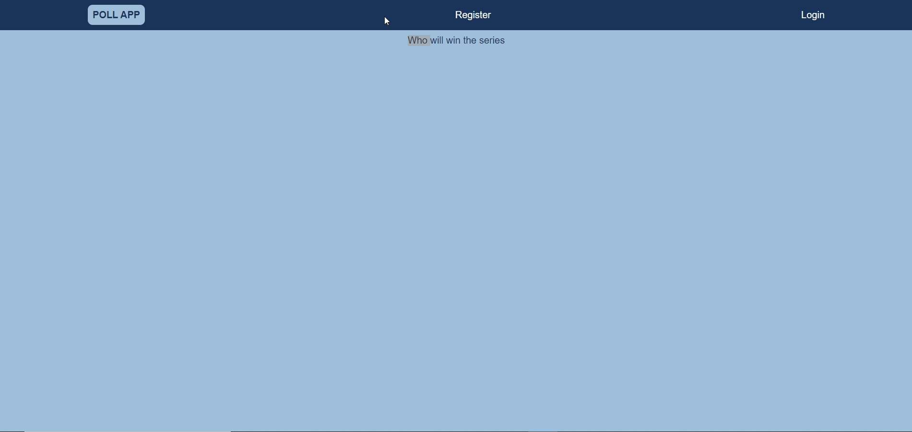

# Voting-Application

# Features
<li>As an authenticated user, I can keep my polls and come back later to access them</li>
<li>As an authenticated user, I can see the aggregate results of my polls</li>
<li>As an authenticated user, I can create a poll with any number of possible items</li>
<li>As an unauthenticated or authenticated user, I can see and vote on everyone's polls</li>
<li>As an unauthenticated or authenticated user, I can see the results of polls in chart form. (This could be implemented using Chart.js)</li> 

# Built with
<li>Nodejs</li>
<li>MongoDB</li>
<li>React</li>
<li>JWT Authentication</li>

# Installation
To install this project on your local desktop, clone this repository and include a .env file in the server directory and set the following environment variables

---
**NOTE**
<ol>
  <li>MONGODB_URI = "Your database link"</li>
  <li>JWT_SECRET = "Some random string"</li>

---

